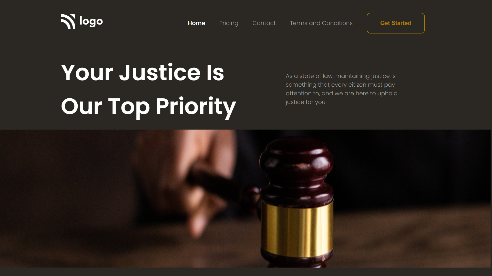

# Lawyer's Portfolio Website

My name is Shivam Sharma, and this is the first project of the FSJS Bootcamp in which I'm currently enrolled.

 Time taken to complete this project is around **3 hrs**

**Key learnings :** 

- Pseudo Selectors 
- Use of different type of display properties like : inline, inline-block, etc
- Different properties of flexbox
- Positions properties like : Relative, Absolute,etc

**Technology Used :**

**Deployed On :** 

## Screenshots

## 🔗 Links

